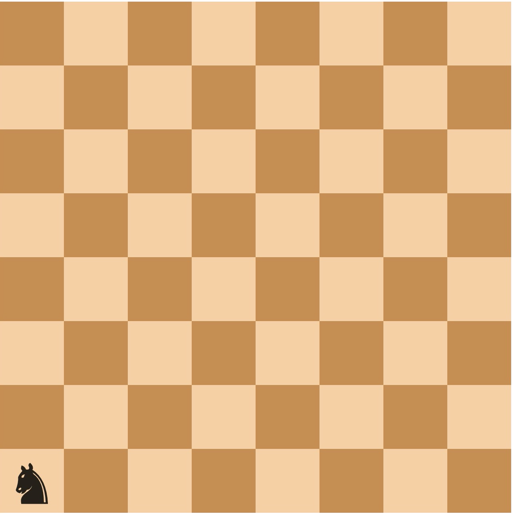
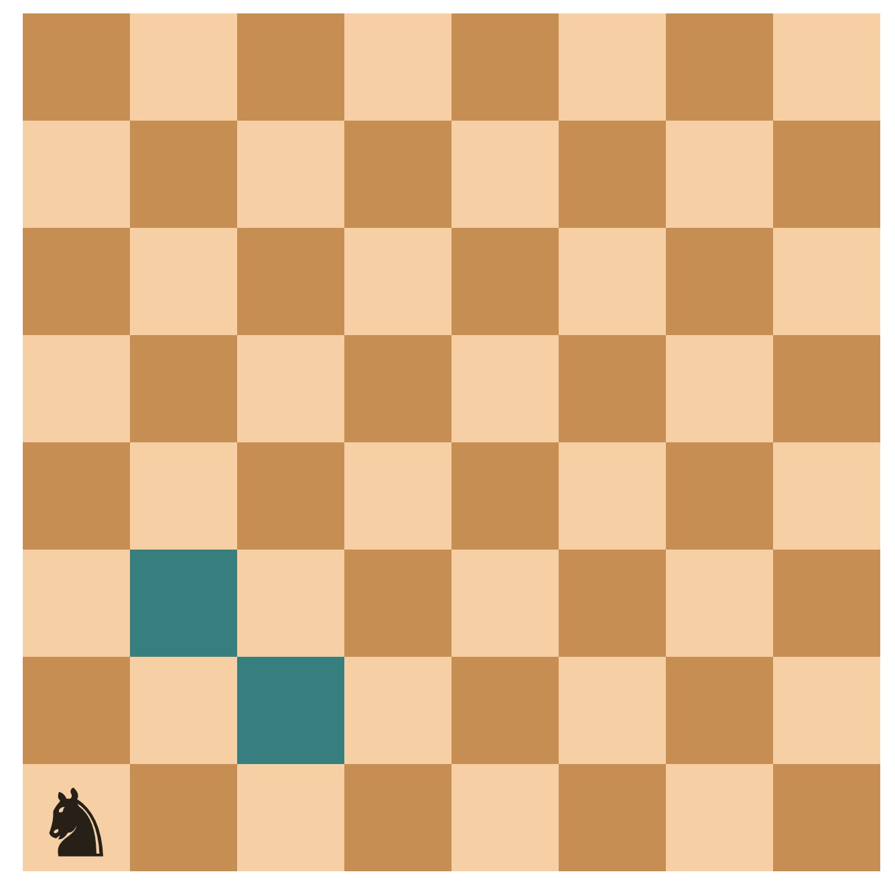
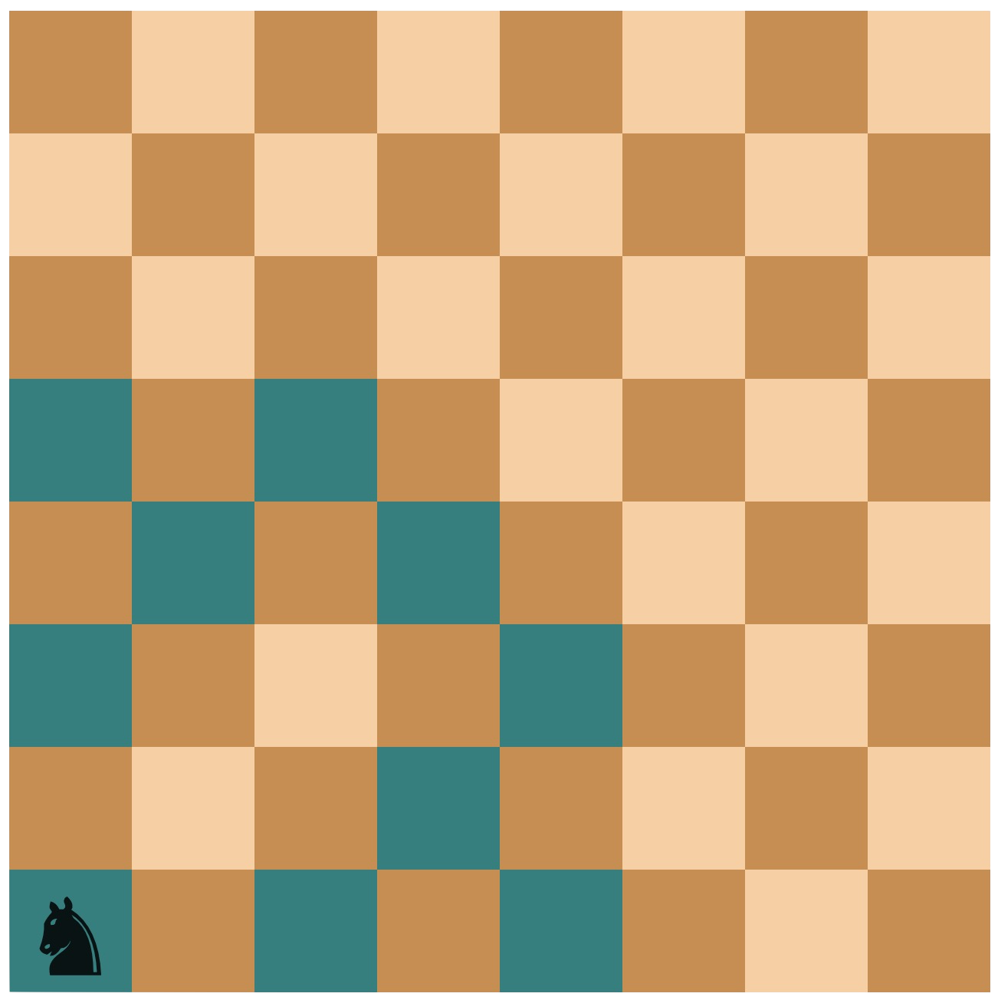
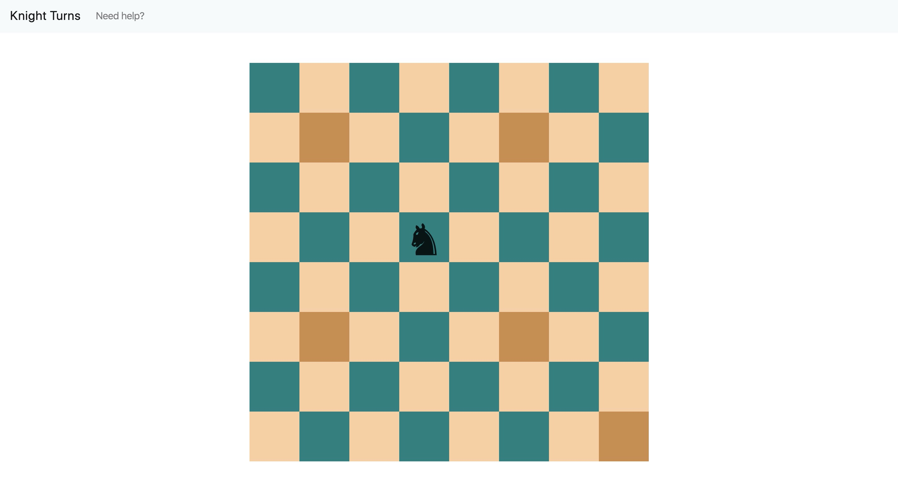
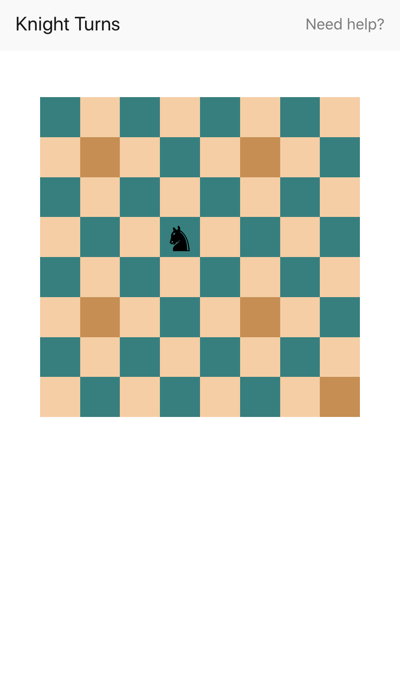

#  Chess Knight 

[](https://circleci.com/gh/ribeirojose/ae-knight) [](https://coveralls.io/github/ribeirojose/ae-knight?branch=master) [](/LICENCE.md)

## Table of Contents
- [Structure](#structure)
- [Architecture](#architecture)
- [Algorithm](#algorithm)
- [Usage](#usage)
- [Screenshots](#Screenshots)
- [Contributing](#contributing)


## Structure 

This project was bootstrapped project using [AEboilerplate](https://github.com/agencyenterprise/aeboilerplate. Therefore, the structure is very similar to that of the boilerplate. Authentication was pruned, as it was not a required feature, as well as everything that strictly not to do with what is implemented by this project. The main changes are concentrated in the following directories:

```
ae-knight
│
└──api
│   └──src
│         └──api
│         │   └──knight
│         │   
│         └──services
│             └──knight
└──client
    │   
    └──public
    │   ...
    │
    └──src
        └──api
        │    └──knight
        │
        └──components
        │  ...
        │  
        └──containers
        │  ...
        │  
        └──redux
           ...
```

## Architecture

As a result of being initiated from [AEboilerplate](https://github.com/agencyenterprise/aeboilerplate, this project comprises two independent applications: a client (or frontend) application, and an API (or backend). Since I used the boilerplate to generate the project, the backend app also connects to a database, even though no current features require database transactions.

## Algorithm

To find the possible positions for a Chess knight in N turns, we use a recursive strategy that takes as inputs:

1) the starting position; 
2) the turn number we want to find the possible positions for. 

The strategy is centered around two steps: 

1) finding the next positions; 
2) applying itself for each of the found positions and passing along the original number of turns minus 1. 

To accomplish (1), we decompose the algebraic position and find the indexes for column and row in canonical arrays that map columns `[A, B, C, D, E, F, G, H]` (from left to right) and rows `[8, 7, 6, 5, 4, 3, 2, 1]` (from top to bottom) in the Chess matrix. These indexes will be used to find the available positions in the next turn. Since a knight can move either 2 squares horizontally and 1 square vertically or 2 squares vertically and 1 square horizontally, there is an analogy with shifting the canonical indexes in the same amount. Therefore, the resulting possible positions for the next turn is a combination of the possible column and row indexes.

### Example 

Let's find the possible positions that a knight could achieve in two turns, given position `A1` (in algebraic notation). 



*Fig. 1: Knight positioned at A1*

First, we must find the possible positions in the next turn. The algebraic position is mapped to column index `1` and row index `7`. Possible position in the next turns are a combination of `(columnIndex ± 2, rowIndex ± 1)` or `(columnIndex ± 1, rowIndex ± 2)`.

Those positions that fall out of the array bounds are impossible. Therefore, we are left with:

```
(columnIndex + 2, rowIndex + 1) => impossible
(columnIndex + 2, rowIndex - 1) => C2
(columnIndex - 2, rowIndex + 1) => impossible
(columnIndex - 2, rowIndex - 1) => impossible
(columnIndex + 1, rowIndex + 2) => impossible
(columnIndex + 1, rowIndex - 2) => B3
(columnIndex - 1, rowIndex + 2) => impossible
(columnIndex - 1, rowIndex - 2) => impossible

Result: [C2, B3]
```


*Fig. 2: Available positions for the 1st move*

The algorithm is then applied using `C2` and `B3` as the starting position, and we get the possible choices for a second turn. 

For `C2` (columnIndex: 2, rowIndex: 6):
```
(columnIndex + 2, rowIndex + 1) => E1
(columnIndex + 2, rowIndex - 1) => E3
(columnIndex - 2, rowIndex + 1) => A1
(columnIndex - 2, rowIndex - 1) => A3
(columnIndex + 1, rowIndex + 2) => impossible
(columnIndex + 1, rowIndex - 2) => D4
(columnIndex - 1, rowIndex + 2) => impossible
(columnIndex - 1, rowIndex - 2) => B4

Result: [E1, E3, A1, A3, D4, B4]
```

For `B3` (columnIndex: 1, rowIndex: 5):
```
(columnIndex + 2, rowIndex + 1) => D2
(columnIndex + 2, rowIndex - 1) => D4
(columnIndex - 2, rowIndex + 1) => impossible
(columnIndex - 2, rowIndex - 1) => impossible
(columnIndex + 1, rowIndex + 2) => C1
(columnIndex + 1, rowIndex - 2) => C5
(columnIndex - 1, rowIndex + 2) => A1
(columnIndex - 1, rowIndex - 2) => A5

Result: [D2, D4, C1, C5, A1, A5]
```

A1 and D4 are duplicates, so we are left with `[E1, E3, A3, B4, D2, D4, C1, C5, A1, A5]`



*Fig. 3: Available positions for the 2nd move*

In our implementation, we call a `getKnightNTurn`, which passes on the current position to `findNextTurn` and receives an additional argument, the number of turns. The `findNextTurn` function returns an Array with the available positions to `getKnightNTurn`. For each one of these, `getKnightNTurn` calls itself with the original number of turns minus 1. 

The time complexity for the implemented algorithm increases exponentially. Therefore, if project requirements change to, say, allow the user to preview an N-configurable amount of turns, a more efficient strategy must be thought of.

## Usage

Make sure you have Docker running and run:

```shell
npm run dev
```

This will get the client, API, and database instances running. In order to get more details, please refer to [CONTRIBUTING.md](/docs/CONTRIBUTING.md)

## Screenshots



*Fig. 4: MacOS screenshot*



*Fig. 5: iOS screenshot*


## Contributing 
Please refer to [CONTRIBUTING.md](docs/CONTRIBUTING.md).

## Licence
This project is licensed under the MIT License. For details, see [LICENCE.md](docs/LICENCE.md).
